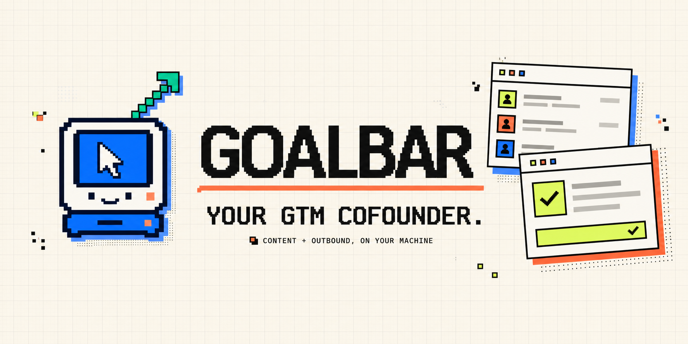

  

  <strong>Find the right conversations. Draft the reply. You approve the send.</strong>

  <a href="https://www.goalbar.top/landing"><strong>Get Goalbar</strong></a>
  ·
  <a href="https://github.com/ducnguyen67201/Goalbar/discussions">Community</a>
  ·
  <a href="https://github.com/ducnguyen67201/Goalbar/issues/new?template=bug_report.yml">Report a bug</a>

  Local-first. Your sessions stay on your machine. Every send stays under your control.

